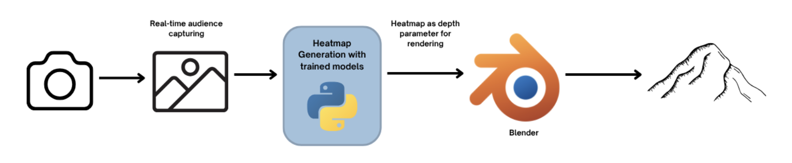
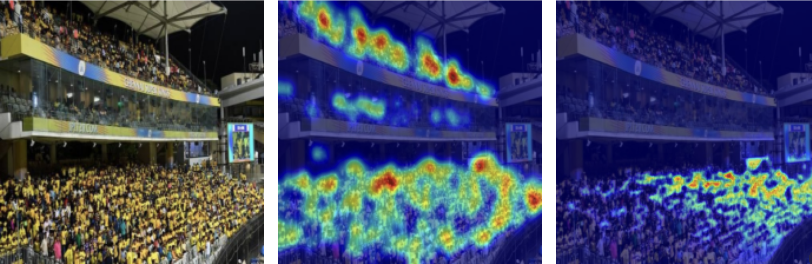
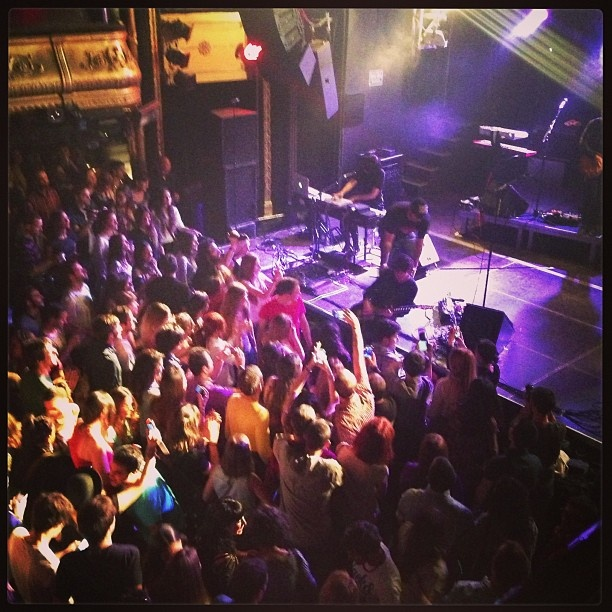
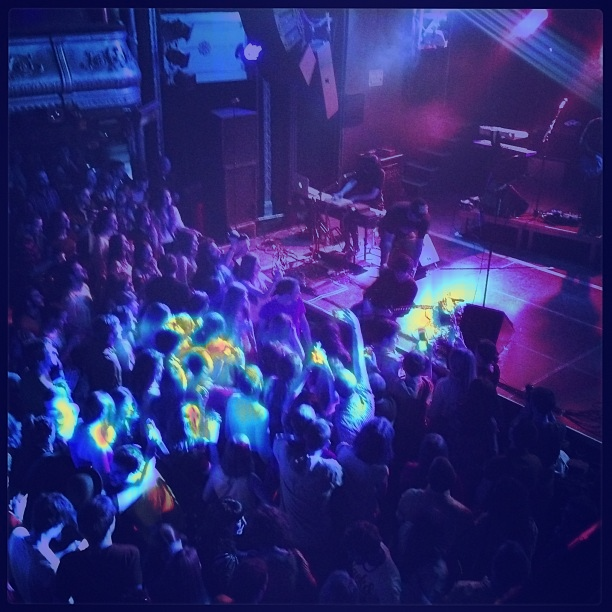
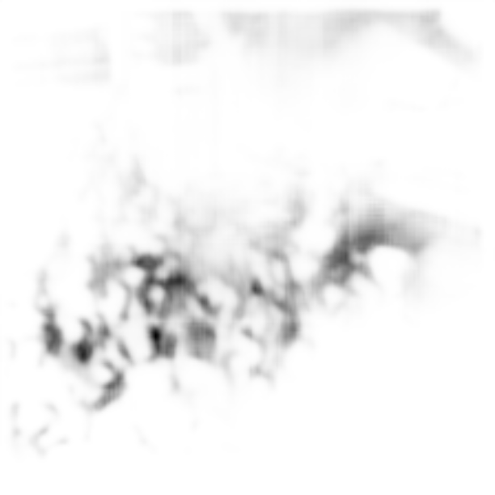
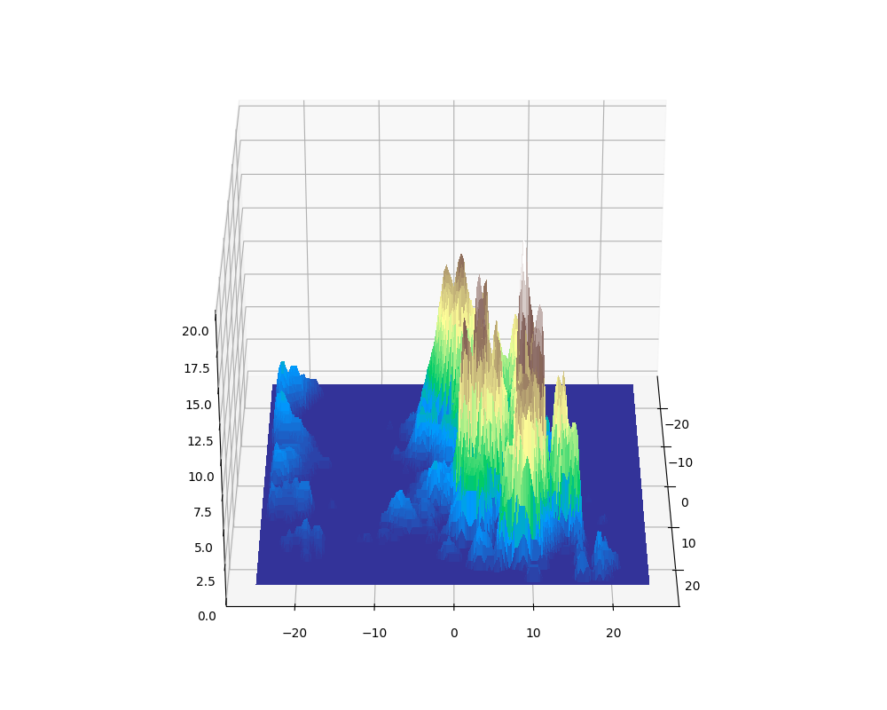
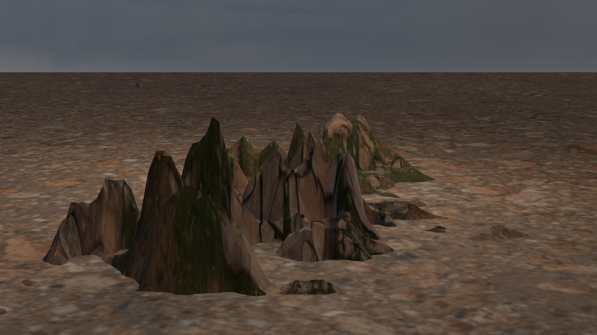
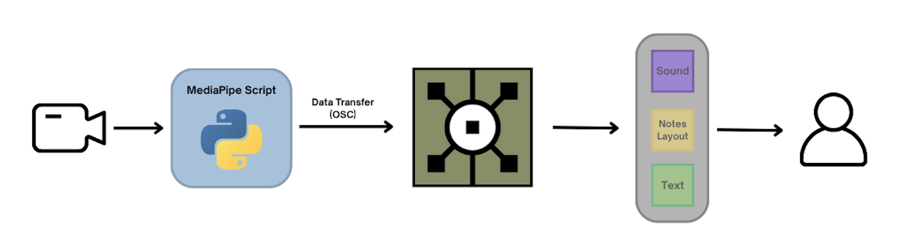
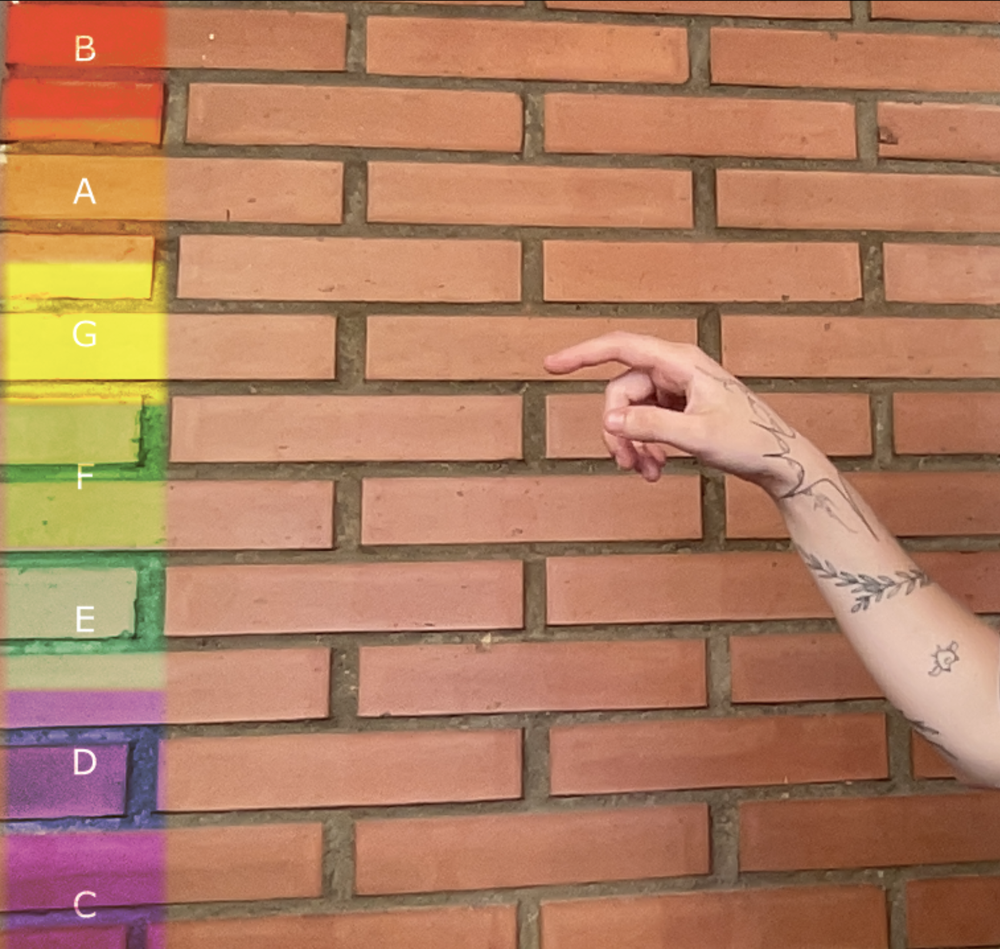

# Interactive Performances: Real-Time AI Systems Shaping Audience and Artist Experiences
In this git you will find all the source code for my Degree's Final Project related with the use of AI systems in live performances for enhancing artist and audience experience.

## Environment Set-up
Before creating the environment ensure that you have python installed in your device, this environment was created using python 3.8.10.

#### 1. Creation/activation of the environment
First, create a new `heat_env` environment and activate it before installing the dependencies 
```bash
python3.8 -m venv tfg_env
```
#### 2. Dependencies installation 
Install all the dependencies defined in the `requirements.txt` file
```bash
pip install -r requirements.txt
```
## Heatmaps
<div align="center">
  
</div>

### Dataset Set-up

The models are trained and tested using the **JHU-Crowd++** dataset from Kaggle. To proceed with the execution, first install the complete dataset from the link and execute the pre-processing data file in `heatmaps/data_preprocessing.py`.
This is necessary since the dataset does not provide the heatmaps required for training and testing directly.


- **Kaggle link for download:** https://www.kaggle.com/datasets/hoangxuanviet/jhu-crowd/data  

> **⚠️ Note:** Ensure that the paths in the `data_preprocessing.py` file are correct before executing.

### Blender Set-up 
To perform the rendering the installation of Blender is required. 
- Follow this link to download the latest version: https://www.blender.org/


### Training
The trainig scripts for each model can be found in the `train/` folder. Any hyperparameter specification can be defined in the upper section of the script. A link to the trained models can be found in the folder `models/`. The images above show the results obtained for the UNet BCE with Logits model. <br><br>


### Inference Results
For this same model, here are the obtained results with an image in the context of a concert. The image represent the **Original Image**, the **Overlayed Heatmap**, the **Greyscale Heatmap**, a **3D plotting** for preview and the resulting **Render** with Blender.
<table style="width:100%; border: none;">
  <tr>
    <td style="border: none; text-align:center;">
      
    </td>
    <td style="border: none; text-align:center;">
      
    </td>
    <td style="border: none; text-align:center;">
      
    </td>
    <td style="border: none; text-align:center;">
      
    </td>
    <td style="border: none; text-align:center;">
      
    </td>
  </tr>
</table>

To obtain the greyscale image and the 3D plot you must run the code in `render/model_name`. To get the render with the textures you need to open the `render/montaña_render.blend` file and load **manually** the greyscale image in the **Material** section in the right panel. 

## Music
<div align="center">
  
</div>

### TouchDesigner Set-up
To use the software the installation of TouchDesigner is required. 
- Follow this link to download the latest version: https://derivative.ca/download

### Software Set-up
To start using the system, you need to open the file `music/note_tracker.72.toe` and play it. Once this is done, you need to run locally the `music/hand_tracker.py` for MediaPipe to start tracking your hand movement.

Here is a preview of the interface: <br><br>
<div align="center">
  
</div>

For testing, just run the `music/mediapipe_test.py` file, setting the desired time for the duration of the session, and once you have performed all the tests you can analyze the results by running `music/analyze_results.py` 


